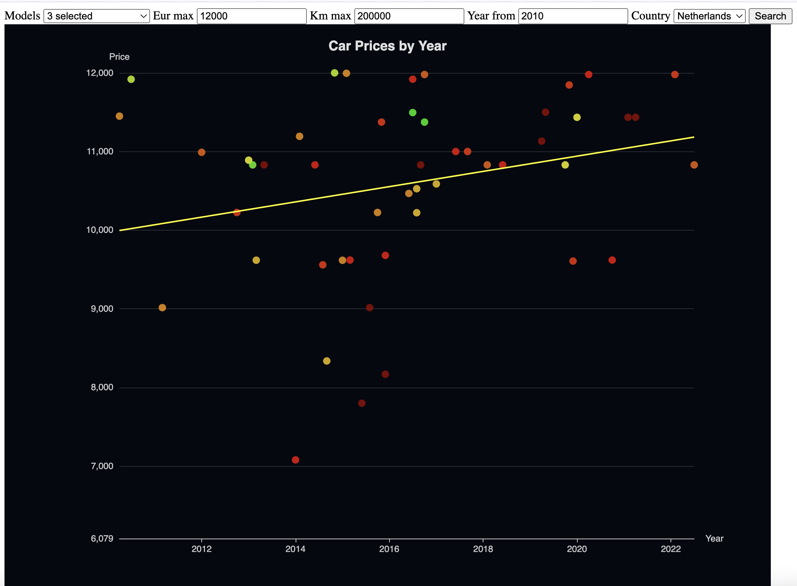

# Carscraper

Scrapes every listing for one car model from four used-car sites across several
countries and plots them on one graph: build date against price including
import costs.



A car under the trend line asks less than its age suggests. Colour is mileage
per year, green low to red high.

Rails 8.1, Ruby 4.0, PostgreSQL. Finished, not maintained.

## Install

Ruby 4.0.2 and PostgreSQL, both pinned in `mise.toml`.

```
bin/setup
bin/rails postcodes:import                                    # for distances
bin/rails runner 'Model.create(make: "Volkswagen", model: "ID-Buzz")'
bin/rails cars:scrape
```

A round asks four sites three seconds apart and takes a few minutes.

## Configure

`config/home.yml`, not in git, is where distances are measured from.
`HOME_LATITUDE`, `HOME_LONGITUDE`, `HOME_POSTCODE` and `HOME_COUNTRY` override
it.

```yaml
latitude: 52.379
longitude: 4.900
country: NL
```

One row of `models` is one search, editable at `/models`.

| Column | |
| --- | --- |
| `make`, `model` | what to search for. `ID-Buzz` also finds `ID.Buzz`, `ID. Buzz`, `id buzz` |
| `min_seats` | bin a listing advertising fewer seats |
| `min_kwh` | bin a listing advertising a smaller battery, kWh net |
| `exclude_versions` | comma-separated: `"ID.3, ID.4, Cargo"` |

`min_seats` and `min_kwh` judge only a listing that states a value. Both are
re-applied after every scrape.

`CARSCRAPER_PASSWORD` puts HTTP basic auth on every write. Reads are open.

## Commands

```
bin/rails cars:scrape         # every source for every model, then the tidy-up
bin/rails cars:tidy           # the tidy-up alone
bin/rails cars:details        # seats and battery from listing pages
bin/rails cars:photos         # fetch missing photographs
bin/rails postcodes:import    # GeoNames postcode tables
```

| Console | Run after |
| --- | --- |
| `Car.recalculate_bargains!` | anything that moves the trend line |
| `Car.recalculate_distances!` | moving, or importing more postcodes |
| `Car.recalculate_eur!` | changing `NOK_PER_EUR` / `SEK_PER_EUR` |
| `Car.renormalise_kwh!` | changing `Car::BATTERY_PACKS` |

## Pages

`/cars` the graph, `/cars/table` sortable, `/cars/photos` a wall, `/cars/bin`
what you binned, `/cars/:id` one car, `/models` the searches.

Filter and sort are shared across the pages and kept in the session for 90 days;
`?clear=1` resets them.

## Sources

| Scraper | Site | Covers |
| --- | --- | --- |
| `Scrapers::Autoscout24` | autoscout24.nl | NL, BE, DE, LU — see `COUNTRIES` |
| `Scrapers::GebrauchtwagenDe` | 12gebrauchtwagen.de | DE; aggregates mobile.de, heycar, autohero, carwow |
| `Scrapers::Autotrack` | autotrack.nl | NL |
| `Scrapers::Gaspedaal` | gaspedaal.nl | NL; aggregates Marktplaats, ANWB, dealer sites |
| `Scrapers::FinnNo` | finn.no | NO, kroner. Outside the default round |

A new one inherits from `Scrapers::Base` and implements `#scrape`. Put every
listing through `matches_model?`: these sites return their whole stock when a
url filter stops being understood. Leasing offers quote a monthly rate and are
not marked as such in structured data.

## Where you run it

Two of the four sites answer a data-centre address with 403 and a home
connection with 200, same headers either way. `Scrape::MOST_OF_THEM` holds a
source's cars when a round barely saw it, and `REFUSALS_BEFORE_GIVING_UP` stops
after five refusals, so a blocked source costs only its own listings.

`Photos` decides what is missing by looking at a disk and writes to that same
disk, so the database, the pictures and the scrape belong on one machine.

## Notes

Things that cost time to find out.

- A listing is identified by `Car#identity` — source, build month, mileage,
  place, title — not by url. 12gebrauchtwagen redirects through a rotating
  `offer_id`.
- Because the title is in that hash, a site rewriting titles produces new rows.
  `Car.same_listing_as` asks the same question without the title, and skips
  factory-new cars, whose odometers all read alike at prices set per trim.
- Six rules find duplicates: `duplicates`, `photo_twins`, `same_money`,
  `relisted`, `retitled`, `one_advert_twice`. Two listings exactly `Car::VAT`
  apart are one car quoted with and without VAT; the higher one survives.
- A shared photograph is corroboration, not proof — a site without a picture
  hands out a placeholder. Guards: `MOST_SITES_WITH_ONE_CAR`, one asking price,
  odometers within `RELISTED_KM`.
- `hidden_by` is nil or the reason; there is no second column. Rules skip a car
  hidden by hand or starred.
- A listing gone for `SEEN_WINDOW` comes off the pages but stays in the
  database with its note, star and corrections. `Car.forget_long_gone!` deletes
  it after `FORGET_AFTER` if `Car.decided` is false.
- The battery comes off the title, then a labelled capacity in the description,
  then every capacity mentioned when they agree. The last condition matters: the
  bidirectional-charging disclaimer names packs the car may not have.
- `Car::BATTERY_PACKS` maps gross to net (82→77, 84→79, 91→86); sellers quote
  both without saying which.
- WLTP range ÷ WLTP consumption is about 10% over the real pack — that
  consumption is measured at the wall. Range is not comparable across sites
  either: one pack is 443 km on mobile.de and 329 km on AutoScout24.
- `Car.infer_batteries!` fills in silent adverts from wheelbase, build date and
  motor power, records why in `data["kwh_from"]`, and never overwrites an
  advert.
- `Car#bargain_eur` is the distance from a least-squares plane through price,
  year and mileage. The fit ignores trim: a GTX averages 7168 under it and a
  Pure 14514 over it, so compare within one trim.
- `Car::IMPORT_COSTS` is a flat 1700 for DE, BE and LU. No tax is added because
  a fully electric car owes no BPM. Norway carries a `share` of the price as
  well.
- `Photos` stores each picture under a digest of its url. `photo_stored?` asks
  whether it is still the advert's picture; `photo_url` asks whether there is a
  picture at all. As one question they blanked 94 cars when a scrape refreshed
  `image_url`.
- `image/avif` is left out of the image `Accept` although Chrome sends it first:
  gaspedaal and autotrack convert on the fly, and `Photos::TYPES` has no avif.
- HTTParty's timeout is per hop and restarts on every chunk, so `Details` caps a
  car at `MAX_SECONDS`. Of 110 cars read the median was 1.3 seconds and two took
  273 and 196.
- `details_at` is stamped whether or not the page said anything, so it is not
  re-read for `RE_READ_AFTER`. A refusal stamps nothing.

Pacing: search pages 3s apart, listing pages 1s, photographs 0.5s; 40 pages a
country, 300 listing pages and 200 photographs a round.

## Deploying

Kamal, to one server that serves the site, runs the scrape and keeps the
pictures.

```
bin/kamal setup      first time: installs docker, boots postgres, deploys
bin/kamal deploy     rollback, logs, console, psql, scrape, tidy
```

`config/deploy.yml` takes four settings from the environment. Export them or put
them in `.kamal/secrets.local`, which is not in git:

| | |
| --- | --- |
| `DEPLOY_HOST` | the server, by address or hostname |
| `DEPLOY_DOMAIN` | what the site answers to. Needs an A record before the first deploy |
| `DEPLOY_REGISTRY` | where the image is pushed, e.g. `ghcr.io/your-name` |
| `DEPLOY_DB_PORT` | localhost port for postgres, if 5432 is taken |

Secrets live in `config/credentials.yml.enc` (`bin/rails credentials:edit`):
`secret_key_base`, `kamal.registry_user`, `kamal.registry_password`,
`database.password`, `auth.password`, `home.latitude`, `home.longitude`.
`.kamal/secrets` holds only the names. The key is `config/master.key`, kept out
of git.

A `job` container runs GoodJob: the scrape at 07:00 and 19:00 and `PhotosJob`
every 15 minutes (`config/initializers/good_job.rb`). Only a process started
with `GOOD_JOB_ENABLE_CRON=1` schedules anything.

The nine hooks in `.kamal/hooks` refuse on an empty secret, a DNS record
pointing elsewhere, a dirty checkout, the credentials key in git, a migration
against the old image, a deploy that changed nothing, and a proxy reboot.
`ALLOW_DIRTY_TREE=1` and `CONFIRM_PROXY_REBOOT=1` override the last two.
`PROXY_NEIGHBOURS` lists other sites behind the same proxy.

## Classes

All in `app/models`.

| | |
| --- | --- |
| `Scrape` | one round: scrapers, tidy-up, `Details`, `Photos` |
| `Scrapers::Base` | fetching, pacing, text cleanup, saving a `Car` |
| `Car` | the row, and the rules about duplicates and hiding |
| `Details` | what the search cards leave out, from the listing page |
| `Photos` | local copies of every picture |
| `StillThere` | asks whether a listing the round missed is gone |
| `PriceFit` | the plane through price, year and mileage |
| `Scatter` | the graph: points, trend line, colour scale |
| `Postcode`, `Home` | where a car is, where you are, how far apart |

There are no tests.

---

An earlier version of this lived at https://github.com/gerard76/carcrawler.
